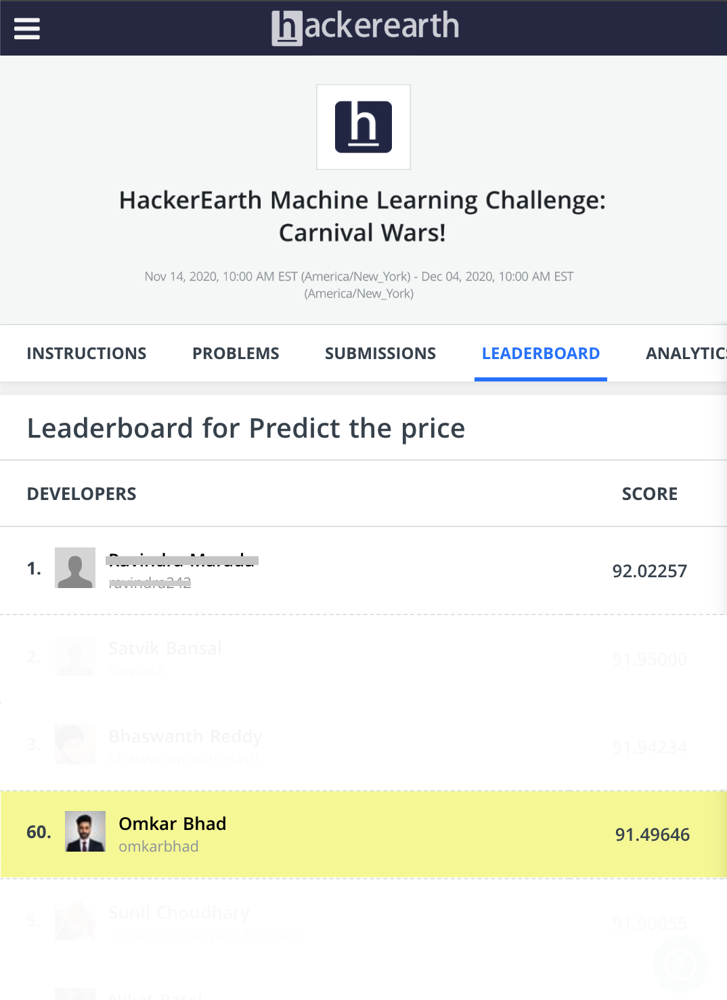

# 🎪 Carnival Wars - Price Prediction

[](https://www.hackerearth.com/challenges/competitive/hackerearth-machine-learning-challenge-predict-selling-price/)
[](https://www.python.org/)
[](LICENSE)

> A high-performing machine learning solution that placed in the **Top 60 globally** in the HackerEarth **Carnival Wars Machine Learning Challenge**. This project showcases end-to-end regression modeling, advanced ensemble techniques, and real-time deployment with Streamlit.

---

## 🎥 Demo

### 🔹 Single Product Prediction

Predict price via a clean UI using dropdowns and numeric inputs.


### 🔸 Batch Prediction

Upload a `.csv` and get results in tabular format with download support.


---

## 🏆 Competition Performance

This solution secured a **Top 60 rank** in the [HackerEarth Carnival Wars ML Challenge](https://www.hackerearth.com/challenges/competitive/hackerearth-machine-learning-challenge-predict-selling-price/), a global challenge focused on price prediction for carnival products.



* 🏆 **Final Rank**: 60
* 📊 **Score**: 91.49646
* 💪 **Margin from Top**: \~0.53%

<p align="center">
  
</p>

---

## 📋 Table of Contents

* [Overview](#-overview)
* [Dataset](#-dataset)
* [Installation](#-installation)
* [Project Structure](#-project-structure)
* [Methodology](#-methodology)
* [Results](#-results)
* [Web Application](#-web-application)
* [Getting Started](#-getting-started)
* [Contributing](#-contributing)
* [License](#-license)

---

## 🌟 Overview

🎯 **Challenge Theme**
Boo yeah, it’s the holiday season again! In a countryside carnival filled with festive joy, the challenge was to help local stall owners predict optimal selling prices for their products. Inspired by the real-world dynamics of seasonal shopping, participants were asked to step into the shoes of data scientists and optimize pricing strategies for higher revenue.

🧠 **Objective**
Build a regression model that accurately predicts product selling prices using features such as product category, market type, grade, demand, pricing limits, available discounts, and time-based attributes.

🛠️ **Why This Matters**

* Reinforces fundamental regression concepts
* Offers real-world price prediction use case
* Encourages thoughtful feature engineering
* Boosts understanding of production-ready modeling through deployment

> This challenge was not only a technical endeavor but a way to apply machine learning for economic upliftment of small-scale vendors — a perfect blend of impact and innovation.

## 📊 Dataset

* Product category, loyalty, and stall metadata
* Historical price data (min, max, charges)
* Stock availability date
* Demand and grade classification

## 🛠️ Installation

```bash
pip install -r requirements.txt
```

Or manually:

```bash
pip install numpy pandas matplotlib seaborn scikit-learn catboost lightgbm xgboost streamlit plotly
```

## 📁 Project Structure

```
.
├── model_training.py           # Training script
├── Dataset/
│   ├── test.csv
│   └── train.csv
├── app.py                      # Streamlit frontend
├── resources/
│   └── stacked_model.pkl       # Trained ensemble model
├── resources/                  # Saved model and leaderboard image
├── requirements.txt
└── README.md
```

## 🚀 Methodology

### Data Preprocessing

* Extracted and encoded date features (day, month, weekofyear)
* Generated cyclic features with sine/cosine transforms
* Added missing value flags and log-scaled charges
* One-hot encoding for product categories

### Modeling and Ensembling

* **Base Models**: CatBoost, LightGBM, XGBoost, Decision Trees
* **Meta-Model**: Linear Regressor on predictions of base models
* **Cross-validation**: K-Fold based performance validation
* **GPU Acceleration** enabled for major libraries

## 🏑️ Results

* ✅ Final Model: Voting ensemble + meta-regressor
* 📉 Error reduced by \~9% over best single model
* ⚡ Fast training with automatic GPU detection

## 💻 Web Application

Built with Streamlit for real-time usage and batch predictions.

## ⚙️ Core Snippet

```python
USE_GPU = has_nvidia_gpu()
DEVICE = "GPU" if USE_GPU else "CPU"

MODELS = {
    'catboost': CatBoostRegressor(task_type=DEVICE.lower()),
    'lightgbm': LGBMRegressor(device=DEVICE.lower()),
    'xgboost': XGBRegressor(tree_method='gpu_hist' if USE_GPU else 'auto')
}
```

## 🚀 Getting Started

```bash
git clone https://github.com/omkarbhad/Carnival-Wars-Hackathon.git
cd Carnival-Wars-Hackathon
pip install -r requirements.txt
# If needed: unzip resources.zip -d .  # For Linux/Mac or use Expand-Archive on Windows
```

To train model:

```bash
python model_training.py
```

To launch demo:

```bash
streamlit run app.py
```

## 🤝 Contributing

Feel free to open issues, submit pull requests, or suggest enhancements.

## 📄 License

This project is licensed under the MIT License. See [LICENSE](LICENSE) for details.
